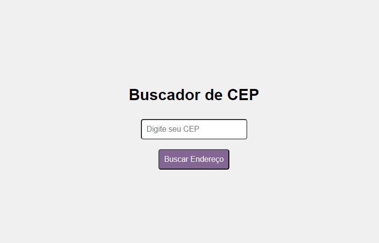

# Buscador de CEP  🔍

### Prática desenvolvendo um Buscador de CEP. 📚

<a href="https://wallcod.github.io/Buscador-de-CEP/"> Clique aqui</a> para acessar o Buscador.

---

## Sobre o Projeto.

Este projeto consiste em criar um buscador de CEP simples. Ele inclui um campo de entrada <strong>(input)</strong> e um botão <strong>(button)</strong>, além de um script para fazer a chamada à API e exibir os resultados.

Para testar mais alguns conhecimentos, acrescentei a estilização no buscador e também nos resultados. 
Criei um arquivo .CSS e adicionei mais alguns códigos no HTML e no JavaScript . 🚀🚀

---

## Autor

- 🦁
- [Wallax Figueiredo](https://www.linkedin.com/in/wallax-figueiredo-41116b285/)

